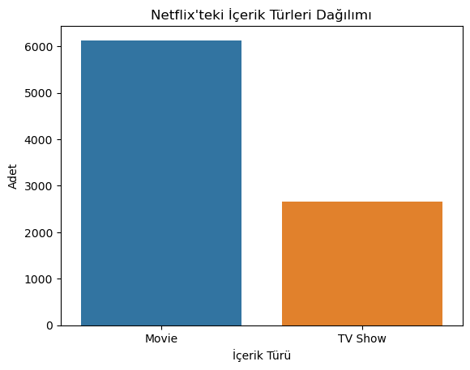
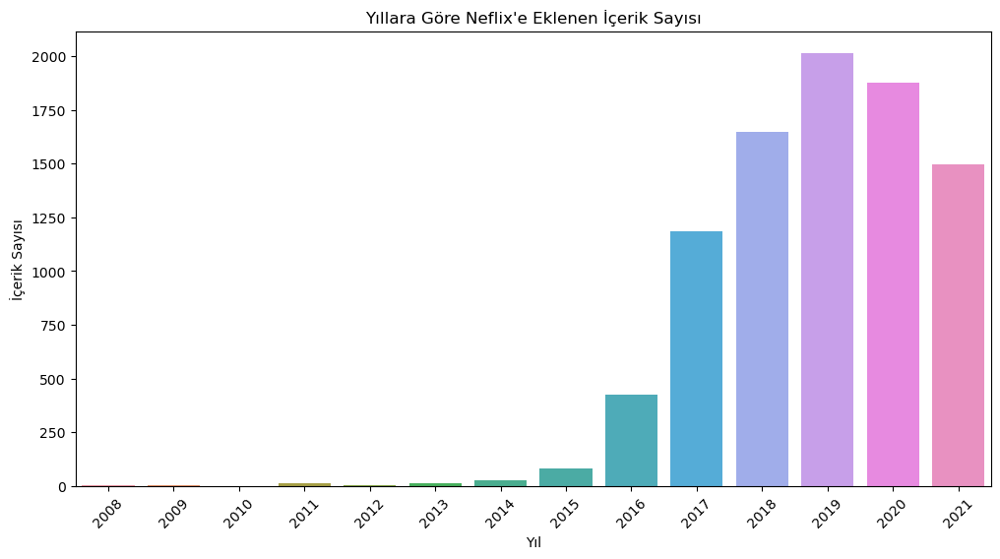
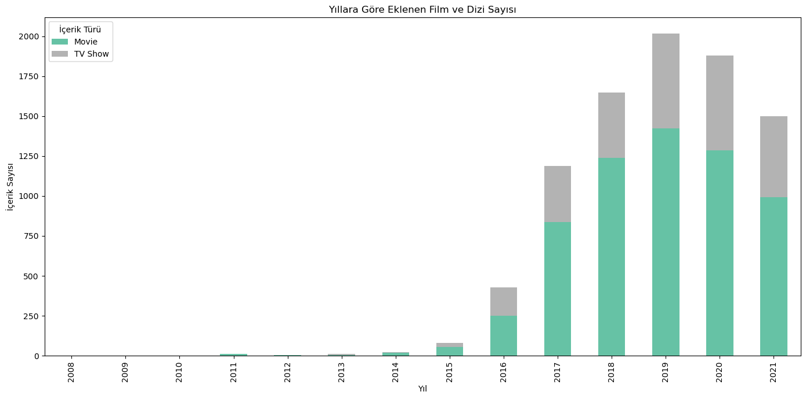
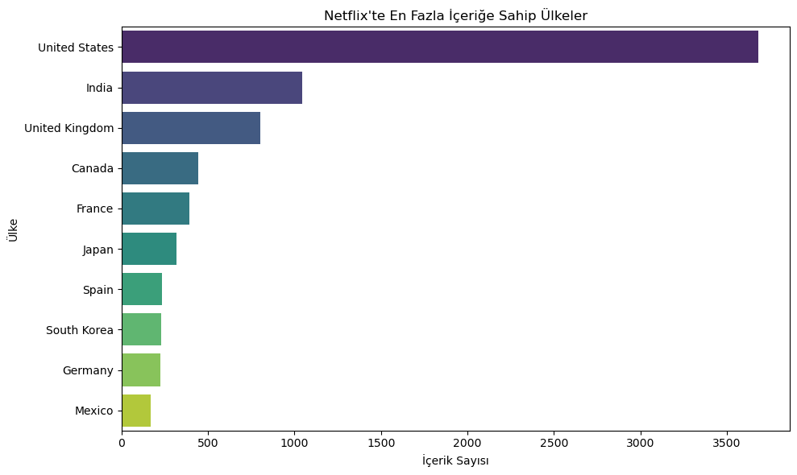
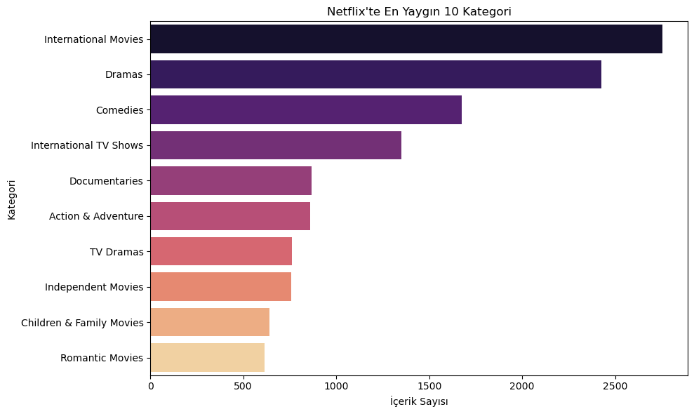

# 📺 Netflix EDA (Exploratory Data Analysis) Projesi

Bu proje, Netflix'in sunduğu içeriklere (film ve diziler) ait veriler üzerinde keşifsel veri analizi (EDA) yaparak, içerik yapısını, yıllara göre dağılımı, ülke bazlı içerik sayılarını ve kategori detaylarını anlamayı amaçlamaktadır.

## 🔍 Veri Seti

- **Kaynak:** [Netflix Titles Dataset](https://www.kaggle.com/datasets/shivamb/netflix-shows)
- **Satır Sayısı:** 8807
- **Sütunlar:**
  - `show_id`, `type`, `title`, `director`, `cast`, `country`, `date_added`, `release_year`, `rating`, `duration`, `listed_in`, `description`

> Not: `director` ve `cast` sütunları, yüksek eksik veri oranı sebebiyle analiz dışında bırakılmıştır.

## ⚙️ Kullanılan Kütüphaneler

- `pandas`
- `numpy`
- `matplotlib`
- `seaborn`
- `plotly`

## 📊 Yapılan Analizler

### 1. 📆 İçeriklerin Yıllara Göre Eklenme Sayısı

- Netflix'e eklenen içerik sayısı 2018'e kadar istikrarlı artarken, 2020'den sonra düşüş yaşanmıştır.

### 2. 🌍 Ülkelere Göre İçerik Dağılımı

- En fazla içeriğin geldiği ülkeler: ABD, Hindistan, Birleşik Krallık

### 3. 📺 Türlere Göre Dağılım (Film vs TV Show)

- Netflix'teki içeriklerin çoğu filmlerden oluşuyor. TV dizilerinin sayısı görece daha az.

### 4. 🏷️ İçerik Türleri (Kategoriler)

- En sık karşılaşılan türler: Dramalar, Uluslararası Filmler, Komediler

### 5. 🎯 Rating Dağılımı

- İçeriklerin büyük bölümü `TV-MA`, `TV-14`, `R` derecelendirmelerine sahip.

### 6. 🕒 Süre Dağılımı

- Filmlerde süre `duration` (dakika olarak), dizilerde ise `sezon sayısı` şeklinde verilmiştir.

## 📷 Görselleştirme Örnekleri

|  |  |  |  |  |
